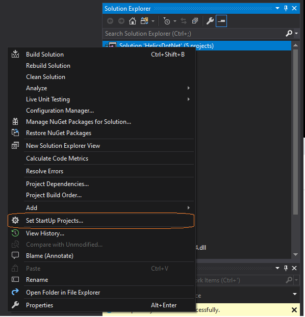
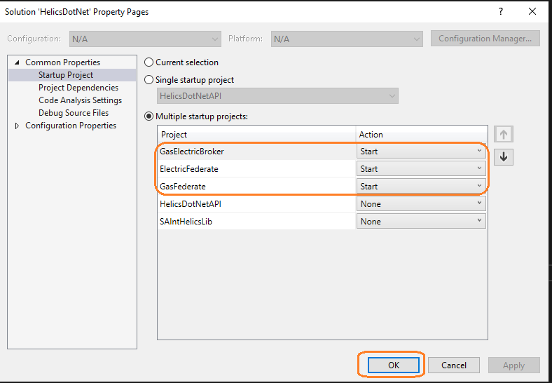
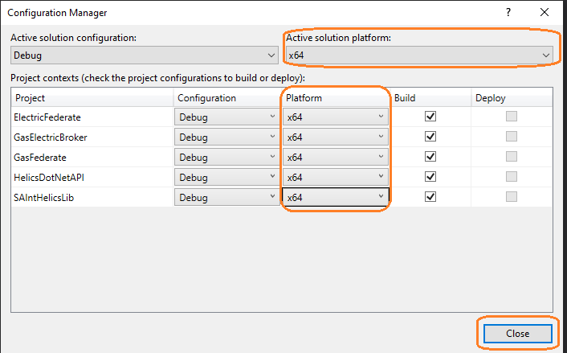
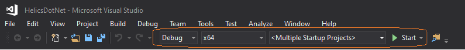

## Overview

The HELICS flags for synchronizing the iterations between the electric and gas federates for a given time step are not functioning properly. As a result, one federate converges faster than the other which may lead to inconsistency as one federate may be running using old data published before the other has stopped. 

To discuss the issue and report it clearly to the HELICS developers, it is required to develop a dummy HELICS project that replicates the issue discussed above. Two federates (gas and electric) that publish and subscribe to synthetic data are created. Some boundary conditions and artificial delay will be introduced in one of the federates so that the two federates run at different speeds.

## Setting up the SAInt_HELICS interface 

This user guide describes the steps for setting up and running the *SAInt_HELICS_interface* project on *Visual Studio*. It is divided into four sections:
- [Clone the HELICS_SAInt_DummyFederates to your working space](#Clone-the-HELICS_SAInt_DummyFederates-to-your-working-space)
- [Loading the visual studio project ](#Loading-the-visual-studio-project)
- [Set the project configuration as a multiple startups](#Set-the-project-configuration-as-a-multiple-startups)
- [Configure the solution platform and run the simulation](#Configure-the-solution-platform-and-run-the-simulation)

#### Clone the HELICS_SAInt_DummyFederates to your working space
  1. Open visual studio.
  2. Go to the *Team* tab and then *Manage Connections*. Alternatively, you can also directly access this by opening the *Team Explorer* from the *View* tab. Also, open the *Solution Explorer* from the *View* tab if it is not opened.
  3. In the *Team Explorer*, go to *Local Git Repositories* and click *Clone*.

  4. In the dialog box that opens, put the URL address of the SAInt_HELICS_interface. Browse the destination directory to point to your workspace folder. Then click *Clone* and wait until it is completed. The link for the URL is: https://github.com/Getnet-Ayele/HELICS_SAInt_DummyFederates

  5. Once cloning is completed, the *HELICS_SAInt_DummyFederates* appears in your *Team Explorer*. 
   
#### Loading the visual studio project 
  1. Double click the *HELICS_SAInt_DummyFederates* in the *Team Explorer*. Then you will see the *HelicsDotNet.sln* solution file.

  2. Double click *HelicsDotNet.sln* to open the project in the *Solution Explorer*.

  3. There are five projects embedded in the *HelicsDotNet* project.
      - *ElectricFederate* loads the electric network, imports the corresponding scenario definitions, and runs the simulation.
     - *GasFederate* loads the gas network, imports the corresponding scenario definitions, and run the simulation.
     - *GasElectricBroker* serves as a broker (connection platform) for the gas and electric federates so that time synchronization and data communication channels are established. Each federate has to be connected to the broker. They must also register their publication and subscription parameters.
     - *HelicsDotNetAPI* provides the API functionality required for the *HELICS* co-simulation environment.
     - *SAIntHelicsLib* provides the mapping factory for the coupling technologies. It has functions that are used to process the data communicated between the federates.
#### Set the project configuration as a multiple startups
  1. At the top of the *Solution Explorer* right click on the *Solution 'HelicsDotNet'* and open *Set StartUP Projects* as shown in Figure 1. 
    
   || 
   |:--:|
   |<b>Figure 1</b>|

  2. In the dialog box that opens, set the *ElectricFederate* and the *GasFederate* to *Start* (see Figure 2). 
    
   || 
   |:--:|
   |<b>Figure 2</b>|

  3. Press *Apply* and then *OK*.
   
#### Configure the solution platform and run the simulation
  1. Configure the solution platform, which is found next to the *Debug* button, to *x64* as shown in Figure 3. 
    
   ||
   |:--:|
   |<b>Figure 3</b>|

  2. Simulate by clicking the green button *Start* in Figure 4.
    
   ||
   |:--:|
   |<b>Figure 4</b>|

  3. There process windows will ope: one for the broker, one for the electric federate and another one for the gas federate.
  4. Once the simulation is completed, the exported solution files will be found in your workspace's *outputs* folder.
